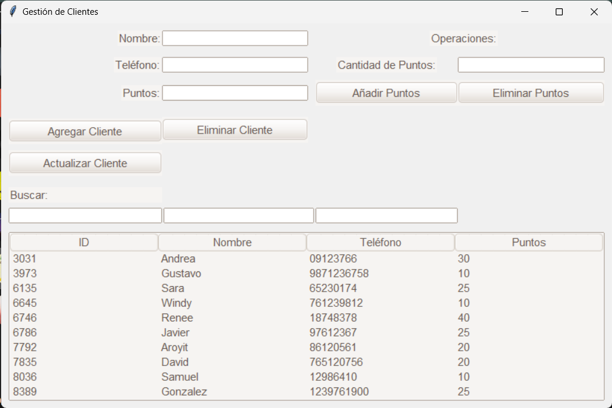

# Registro de clientes con puntos

## Uso
Este programa facilita el registro y gestión de clientes asignándoles puntos. Los campos esenciales, como Nombre, Teléfono, y Puntos, se pueden completar para agregar un nuevo cliente. La interfaz proporciona las siguientes funciones:

- *Agregar Cliente*: Permite ingresar los datos del cliente para su inclusión en el registro.

- *Actualizar Cliente*: Al hacer clic en un cliente en la tabla, sus datos se cargarán automáticamente, lo que facilita la edición. Una vez actualizados, los cambios se guardan mediante el botón correspondiente.

- *Eliminar Cliente*: Elimina de manera segura al cliente seleccionado del registro, con una confirmación para evitar eliminaciones accidentales.

En la sección Operaciones, al seleccionar un cliente, puedes:

- *Añadir Puntos*: Incrementa los puntos del cliente seleccionado. La cantidad de puntos se ingresa en el cuadro correspondiente.

- *Eliminar Puntos*: Reduce los puntos del cliente seleccionado. La cantidad de puntos a eliminar se especifica en el cuadro respectivo.

Además, se ofrece la capacidad de filtrar la lista mediante cuadros de diálogo sobre cada columna, permitiendo búsquedas rápidas por ID, Nombre o Teléfono.

## Captura de pantalla

